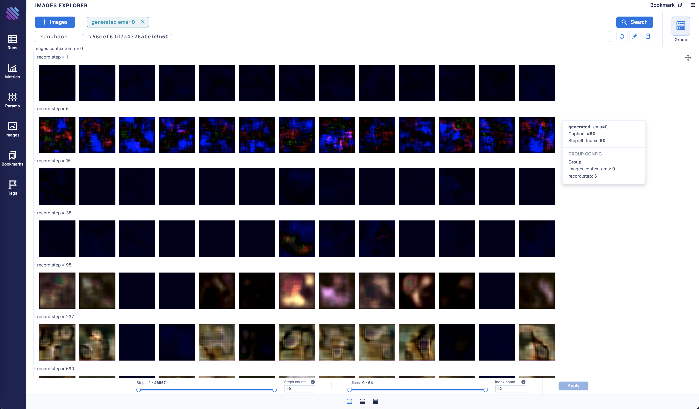
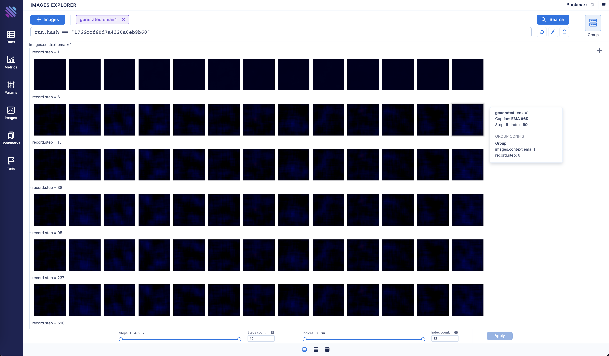
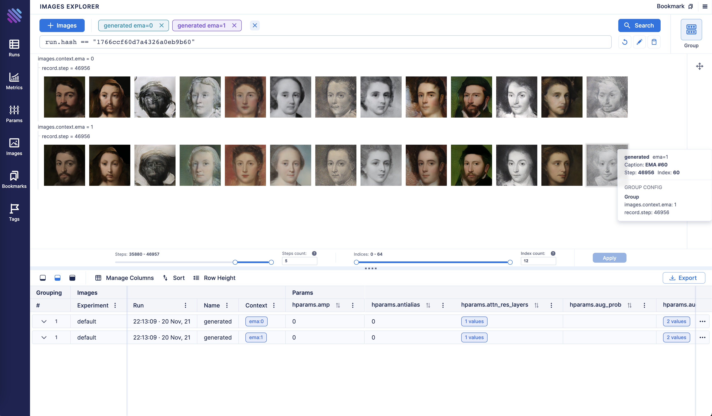
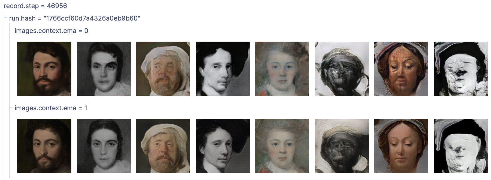
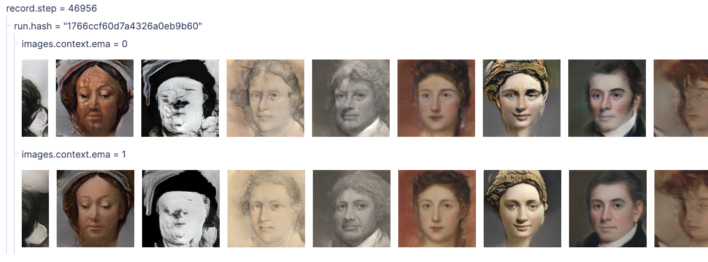

## Track and compare GANs with Aim

### Overview

[Generative Adversarial Networks](https://arxiv.org/abs/1406.2661), or GANs, are deep-learning-based generative models.

Generative modeling is an unsupervised learning task in machine learning that involves automatically discovering and learning the patterns of input data in such a way that the model can be used to generate new examples that plausibly could have been drawn from the original dataset.

In this guide we will show you how to integrate Aim with your GAN and GAN with EMA to compare the generated images from both experiments to compare their performances.

### Experiment

We will train and compare a regular GAN vs GAN with EMA. EMA is a technique for parameter averaging in GAN training, which computes an exponentially discounted sum of weights.

We will use [lightweight-gan](https://github.com/aimhubio) model implemented by [lucidrains](https://github.com/lucidrains) and [MetFaces Dataset](https://github.com/NVlabs/metfaces-dataset) as a training dataset.

To be able to analyze the results we will fix random 64 points and track them during the training both for a regular GAN and GAN w/ EMA.

### Track images with Aim

1. Initialize a new run in the trainer class to collect and store sequences of images:

```python
class Trainer():
    def __init__(
        self,
        name = 'default',
        results_dir = 'results',
        models_dir = 'models',
				...
		):
	...		
	self.run = aim.Run()           # Initialize aim.Run
	self.run['hparams'] = hparams  # Log hyperparams
	...
```

Code on [GitHub](https://github.com/aimhubio/lightweight-gan/blob/636b8a1ea96111a6964a724386e3aef58b3e6201/lightweight_gan/lightweight_gan.py#L983-L987)

2. Track images generated by a regular GAN:

```python
# Regular GAN

# Get generated images
generated_images = self.generate_(self.GAN.G, latents)

aim_images = []
for idx, image in enumerate(generated_images):
    ndarr = image.mul(255).add_(0.5).clamp_(0, 255).permute(1, 2, 0).to('cpu', torch.uint8).numpy()
    im = PIL.Image.fromarray(ndarr)
    aim_images.append(aim.Image(im, caption=f'#{idx}'))

# Store with Aim (name="generated" and context.ema=0)
self.run.track(value=aim_images, name='generated', step=self.steps, context={'ema': False})
```

Code on [GitHub](https://github.com/aimhubio/lightweight-gan/blob/636b8a1ea96111a6964a724386e3aef58b3e6201/lightweight_gan/lightweight_gan.py#L1293-L1306)

3. Track images generated by a GAN with enabled EMA:

```python
# GAN with moving averages

# Get generated images
generated_images = self.generate_(self.GAN.GE, latents)

aim_images = []
for idx, image in enumerate(generated_images):
    ndarr = image.mul(255).add_(0.5).clamp_(0, 255).permute(1, 2, 0).to('cpu', torch.uint8).numpy()
    im = PIL.Image.fromarray(ndarr)
    aim_images.append(aim.Image(im, caption=f'EMA #{idx}'))

# Store with Aim (name="generated" and context.ema=1)
self.run.track(value=aim_images, name='generated', step=self.steps, context={'ema': True})
```

Code on [GitHub](https://github.com/aimhubio/lightweight-gan/blob/636b8a1ea96111a6964a724386e3aef58b3e6201/lightweight_gan/lightweight_gan.py#L1309-L1321)

### Explore the results with Aim UI

1. Visualize images generated by a regular GAN:




2. Visualize images generated by GAN with EMA:




As you may notice GAN with EMA converges in an exponential fashion and has better results at the end.

3. Let's compare the final step of the two methods side by side:







### Conclusion

As you can see GAN with EMA performed much better compared to the regular one.

With Aim you can easily compare diff groups of tracked images from diff runs.

Group them by the run hash, other parameters available to slice and dice and observe the difference between the runs.
