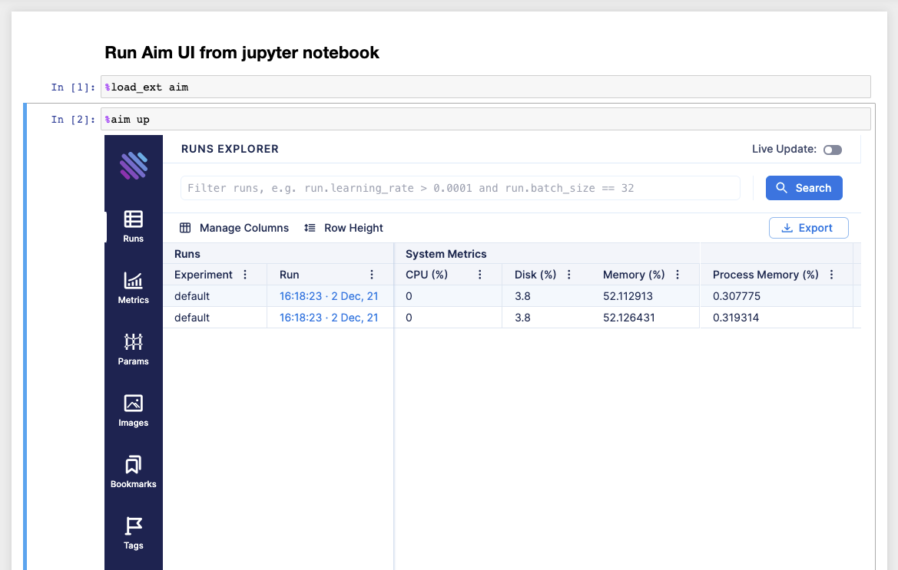

## Aim UI on Jupyter Notebook

Start your notebook with the following code to install Aim:

```jupyter
!pip install aim
```

Next, initialize a new run and save some hyperparameters:

```python
from aim import Run

run = Run()

run['hparams'] = {
    'learning_rate': 0.001,
    'batch_size': 32,
}
```

.. note::
   Do not forget to call run.finalize() once the training is over.

After tracking runs with [aim.Run](../../quick_start/SDK_basics.html#create-a-run),
run the following commands in the notebook to run the Aim UI:

1. Load Aim extension for notebooks:

```jupyter
%load_ext aim
```

2. Run `%aim up` to open Aim UI in the notebook:

```jupyter
%aim up
```

