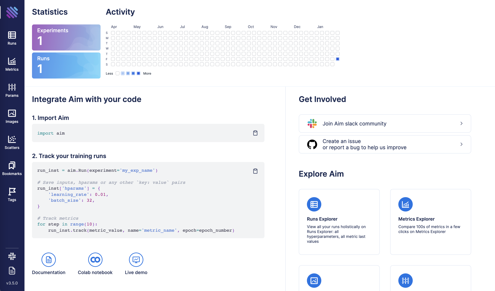
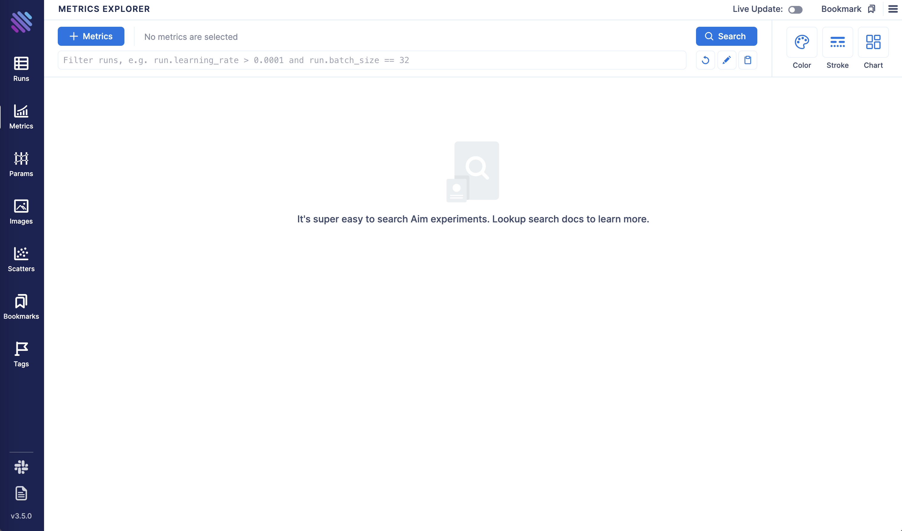
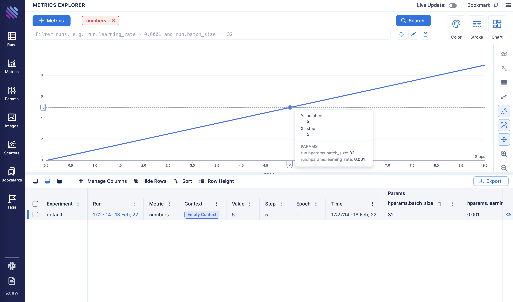

## Get started with Aim

This section describes a simple end-to-end aim setup flow, starting from installation up to running Aim UI and exploring
results. It can be used as a starting point to get familiar with aim interfaces and concepts.

### Installing Aim
Aim package is available for Linux and MacOS for Python versions 3.6+.
Installing aim is really easy using pip:

```shell
pip3 install aim
```

Verify aim was properly installed

```shell
aim version
```

You should see the line listing newly installed version of Aim:
```shell
Aim v3.5.1
```


The installed package includes Python SDK needed for tracking training runs, UI for browsing the results and CLI
for managing UI and results.


### Initializing Aim repository
Aim repository is a centralized place where all training runs should be logged.
To initialize `aim` repo in current working directory run:
```shell
aim init
```

Initialized a new Aim repository at `/home/user/aim`

Your workspace is now ready for tracking trainings with Aim.

### Tracking data with Aim SDK

In order to start tracking results, first you need to create `aim.Run` object:
```python
from aim import Run
run = Run()
```

Run provides a dictionary-like interface for storing training hyperparameters:
```python
hparams_dict = {
    'learning_rate': 0.001,
    'batch_size': 32,
}
run['hparams'] = hparams_dict
```

These params can be used later in the UI to query runs, metrics, images.
To track metrics with aim use the `Run.track` method:
```python
run.track(3.0, name='loss')
```
The complete list of supported inputs is available in section ["Track media and objects"](supported_types.html)

Here's a full example demonstrating steps above:
```python
# aim_test.py
from aim import Run

run = Run()

# set training hyperparameters
run['hparams'] = {
    'learning_rate': 0.001,
    'batch_size': 32,
}

# log metric
for i in range(10):
    run.track(i, name='numbers')
```

Run the script above
```shell
python3 aim_test.py
```

Congrats! Your first run with Aim is ready!
Now it is time to explore results with Aim UI.

### Browsing results with Aim UI
Once the script above finishes you can open Aim UI and see the results:
```shell
aim up
```

You should see the following output meaning Aim UI is up and running:
```shell
Running Aim UI on repo `<Repo#-5930451821203570655 path=/.aim read_only=None>`
Open http://127.0.0.1:43800
Press Ctrl+C to exit
```

Open your browser and navigate to `http://127.0.0.1:43800`
You should be able to see the home page of Aim UI:



Click on Metrics Explorer icon



In the Search bar select a "numbers" metric and click "Search".
You should be able to see line chart with tracked metric:



### Running Aim UI inside notebooks

Run the following commands in the notebook to run the Aim UI:

1. Load Aim extension for notebooks:

```jupyter
%load_ext aim
```

2. Run `%aim up` to open Aim UI in the notebook:

```jupyter
%aim up
```


See [integration guide with Jupyter Notebook](../using/jupyter_notebook_ui.html) for more details.
