## Explorers

### Overview

Aim enables powerful UI to explore logged ML runs and metadata.

### Metrics Explorer

Metrics explorer helps you to compare 100s of metrics within a few clicks.
You can simply group, filter and compare your tracked metrics with Metrics Explorer.
It helps to save lots of time compared to other open-source experiment tracking tools.

Metrics Explorer main parts are:
- Select Form
- Charts
- Table
- Grouping

Features:
- [Query any metric easily](#query-any-metric-easily)
- [Group by any parameter](#group-by-any-parameter)
- [Aggregate grouped metrics](#aggregate-metrics)
- [Align metrics by time, epoch or custom metric](#x-axis-properties)
- [Change scale of the axes (linear or log)](#axes-scale)
- [Apply smoothing](#chart-smoothing)
- [Ignore outliers](#ignore-outliers)
- [Apply highlighting modes (metric on hover, run on hover)](#highlight-modes)
- [Set chart tooltip parameters](#set-tooltip-parameters)
- [Apply zoom in/out on charts](#apply-zoom-on-charts)
- [Export chart as image](#export-chart-as-image)

#### Query any metric easily

Select metrics from dropdown

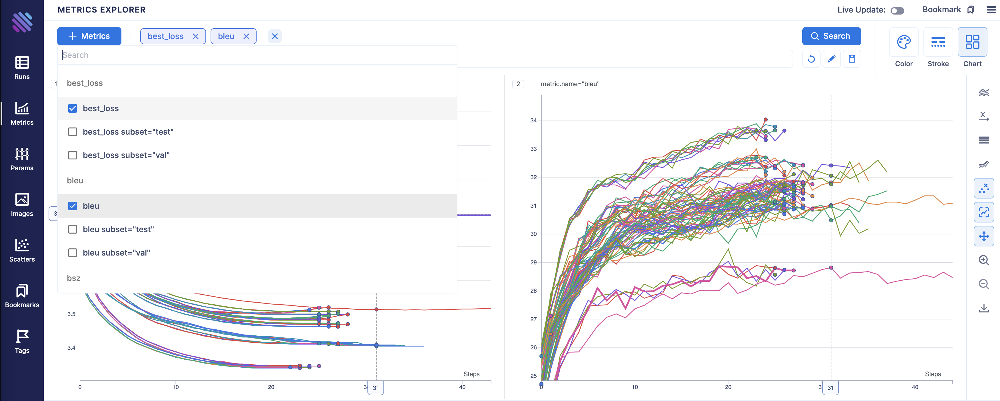

Search runs with [Aim QL](../../using/search.html)

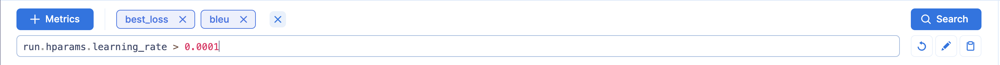

#### Group by any parameter

Group by color, stroke, or chart with selected parameters

##### Group by Color

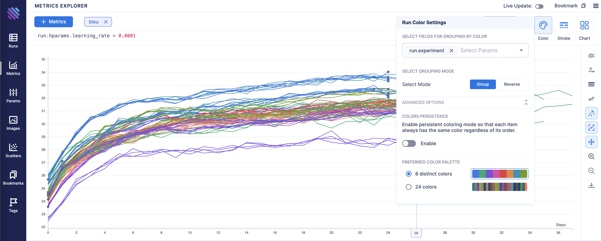

##### Group by Stroke

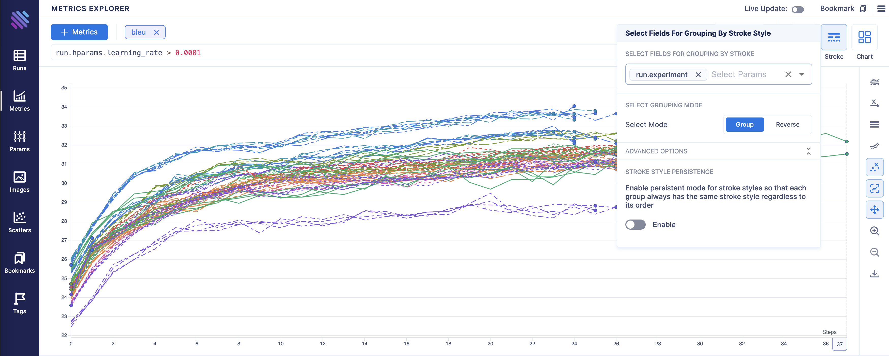

##### Group by Chart

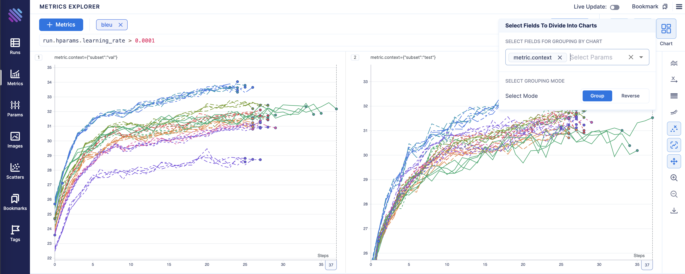

#### Aggregate metrics

When in aggregation mode, a chart shows the aggregated (composed) values instead of the individual values.
This type of display is useful if you want to present summarized results in charts.

##### Aggregation Line:

Following types of aggregation line are available: [Mean](#mean), [Median](#median), [Min](#min), and [Max](#max).
By default, aggregation line is the [Mean](#mean).

###### Mean

By selecting aggregation line Mean, will represent [Arithmetic mean](https://en.wikipedia.org/wiki/Arithmetic_mean) of the tracked metrics:
the sum of a collection of numbers divided by the count of numbers in the collection.

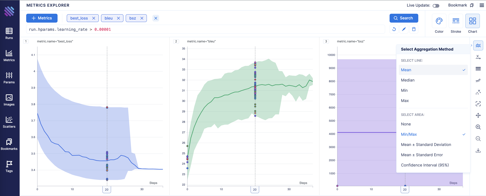

###### Median

By selecting aggregation line Median, will represent [The Median](https://en.wikipedia.org/wiki/Median) of the tracked metrics:
the "middle" number of a finite list of numbers, when those numbers are listed in order from smallest to greatest.

###### Min

By selecting aggregation line Min, will represent minimum tracked metrics values per X.

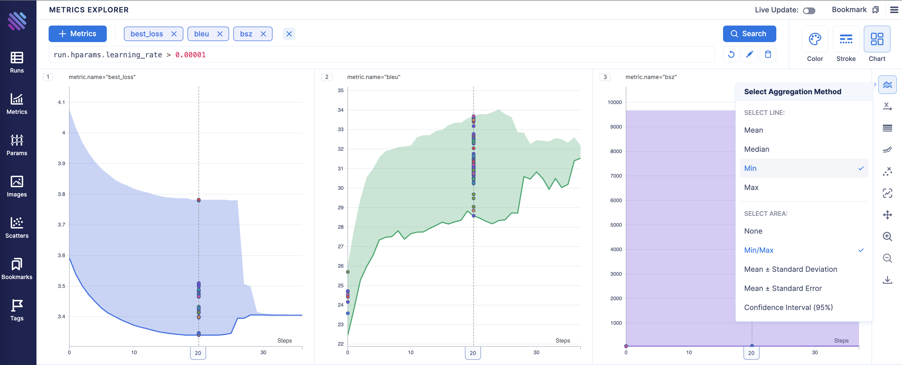

###### Max

By selecting aggregation line Max, will represent maximum tracked metrics values per X.

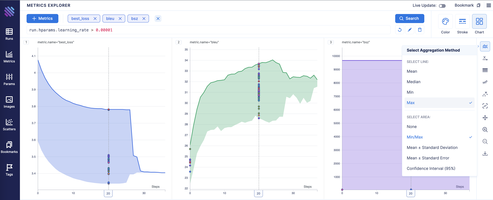

##### Aggregation Area:

Following types of aggregation area are available: [None](#none), [Min/Max](#min-and-max), [Mean ± Standard Deviation](#standard-deviation), [Mean ± Standard Error](#standard-error), and [Confidence Interval (95%)](#confidence-interval).
By default, aggregate area is the [Min/Max](#min-and-max).

###### None

By selecting aggregation area None, will remove aggregated area from chart.

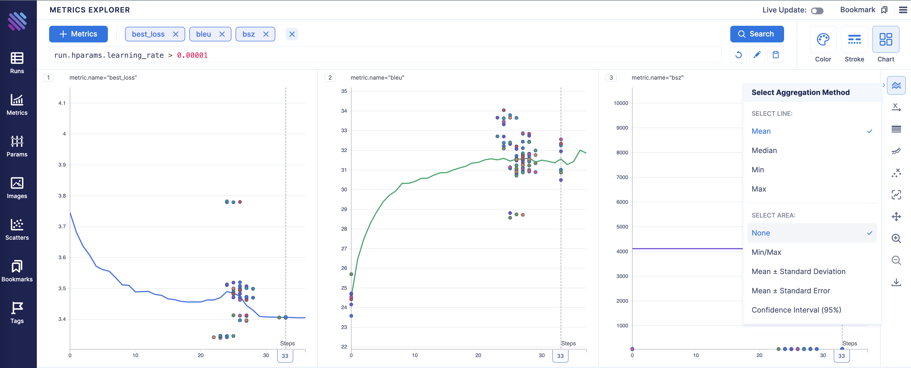

###### Min and Max

By selecting aggregation area Min/Max, will draw area between minimum and maximum of tracked metrics per X.

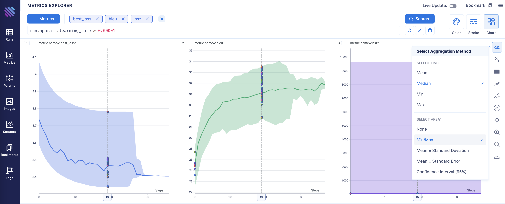

###### Standard Deviation

By selecting aggregation area Mean ± Standard Deviation, will draw area between `mean - standard deviation` and `mean + standard deviation` of tracked metrics per X.

[Mean](#mean), [Standard Deviation](https://en.wikipedia.org/wiki/Standard_deviation)

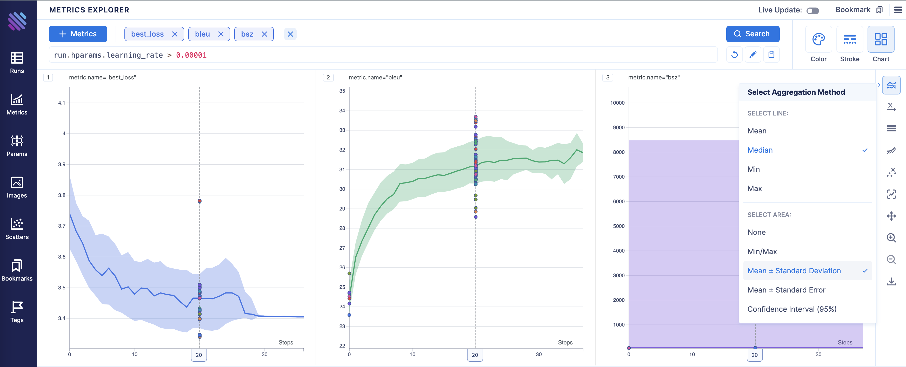 

###### Standard Error

By selecting aggregation area Mean ± Standard Error, will draw area between  `mean - standard error` and `mean + standard error` of tracked metrics per X.

[Mean](#mean), [Standard Error](https://en.wikipedia.org/wiki/Standard_error)

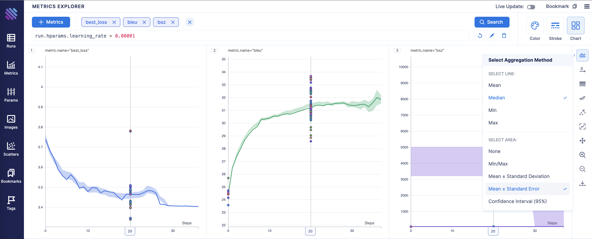 

###### Confidence Interval

By selecting aggregation area Mean ± Confidence Interval, will draw area between `mean - confidence interval` and `mean + confidence interval` of tracked metrics per X.

[Mean](#mean), [Confidence Interval](https://en.wikipedia.org/wiki/Confidence_interval)

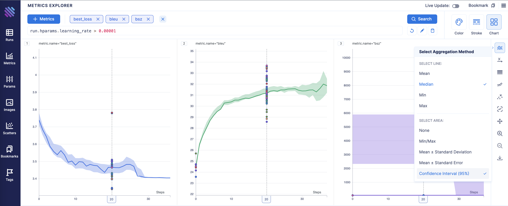 

#### X-Axis properties

X-Axis properties section is for controlling density of metrics x-axis values and aligning metrics by time, epoch or another metric.

##### Density:

Following types of metrics density are available: [Minimum](#minimum), [Medium](#medium), [Maximum](#maximum).
By default, metrics density is the [Maximum](#maximum).

###### Minimum

By setting metrics density to Minimum, will query metrics by 50 point.

###### Medium

By setting metrics density to Medium, will query metrics by 250 point.

###### Maximum

By setting metrics density to Maximum, will query metrics by 500 point.

##### Alignment:

Following types of metrics alignment are available: [Step](#step), [Epoch](#epoch), [Relative Time](#relative-time), [Absolute Time](#absolute-time) and [Custom Metric](#custom-metric).
By default, metrics aligned by [Step](#step).

###### Step

By setting metrics alignment to Step, x-axis values will represent the steps of tracked metrics.

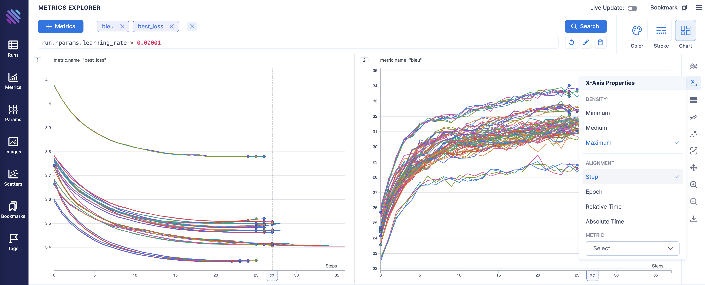

###### Epoch

By setting metrics alignment to Epoch, x-axis values will represent the epochs of tracked metrics.

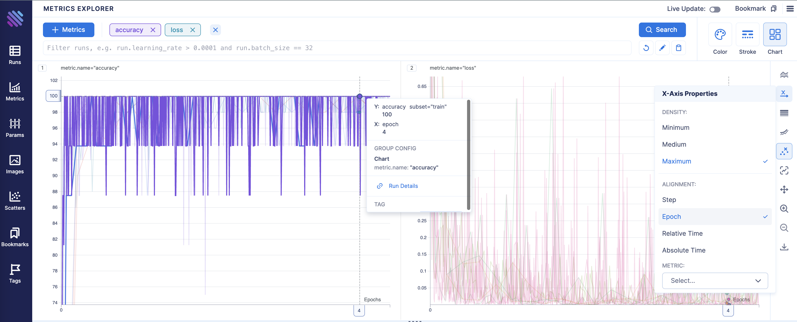

###### Relative Time

By setting metrics alignment to Relative Time, x-axis values will represent by `HH:mm:ss`, duration of tracking process.

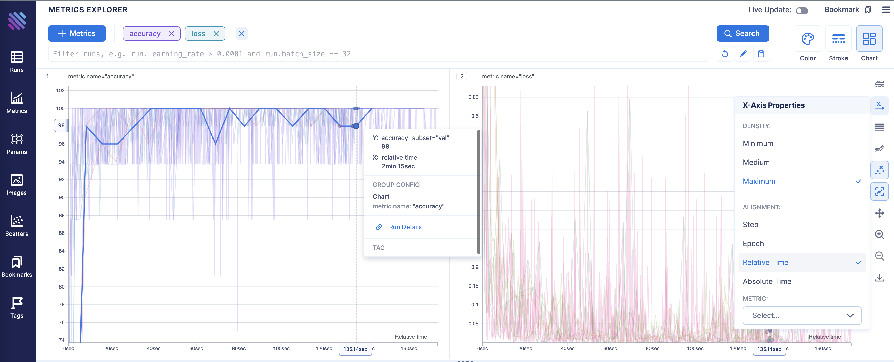

###### Absolute Time

By setting metrics alignment to Absolute Time, x-axis values will represent by date `HH:mm:ss D MMM, YY`, since the start date of the first run until the last run.

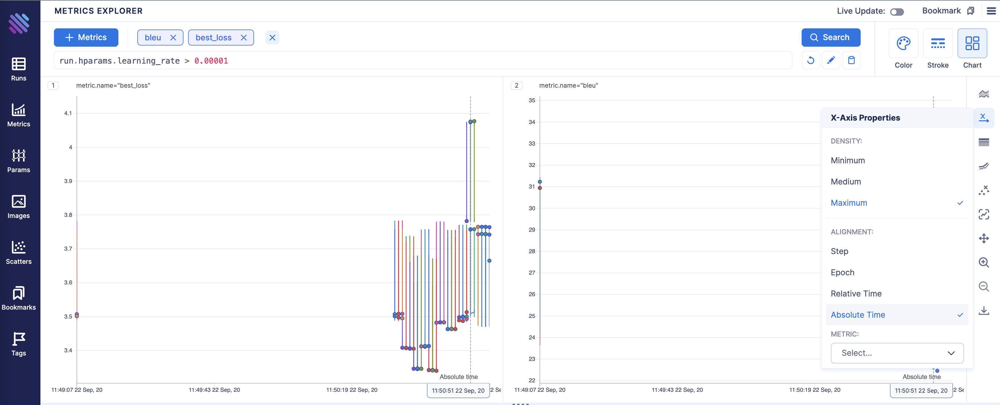

###### Custom Metric

By setting metrics alignment to Custom Metric, x-axis values will represent selected metric values, you can detect correlations between queried metrics and selected metric.

#### Axes Scale

Axes Scale section gives ability to display axes scale's [linear](https://en.wikipedia.org/wiki/Linear_scale) or [logarithmic](https://en.wikipedia.org/wiki/Logarithmic_scale).

By default, axes scale's are [Linear](#linear-scale).

##### Linear Scale

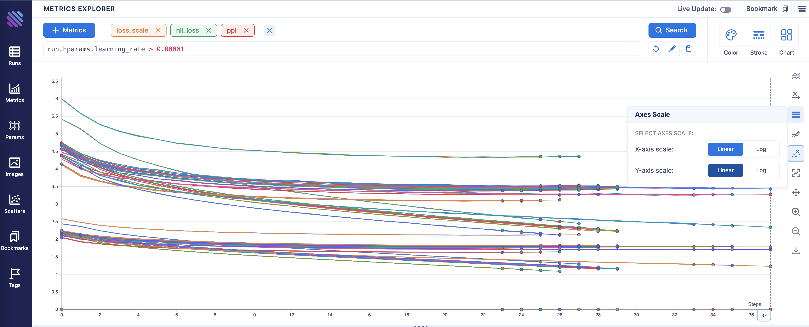

##### X-axis scale: Linear, Y-axis scale: Log

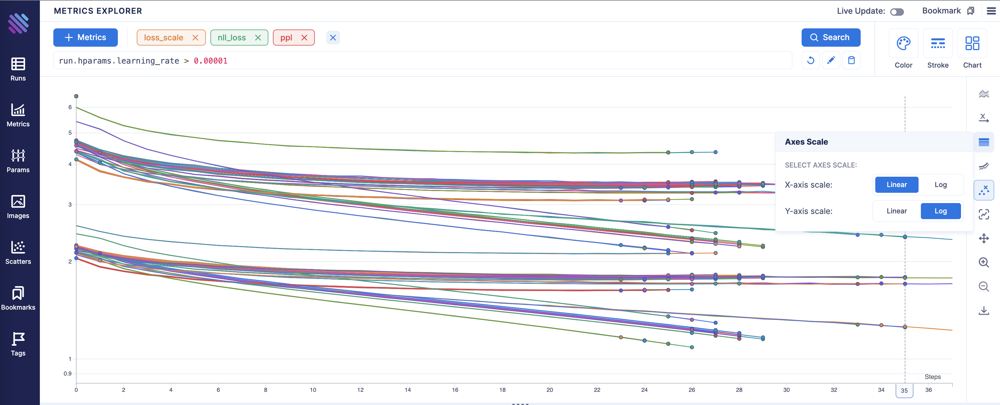

##### X-axis scale: Log, Y-axis scale: Linear

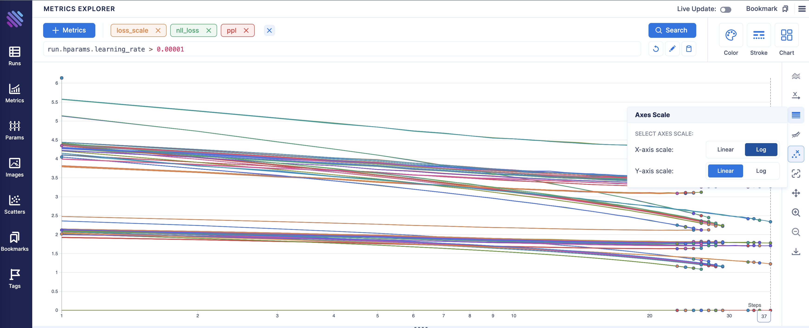

##### Log Scale

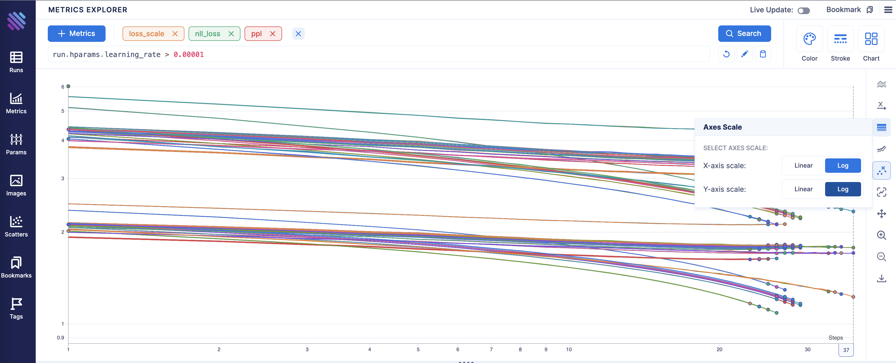

#### Chart Smoothing

While smoothing the chart, the data points are modified so individual points higher than the adjacent points (presumably because of noise) are reduced, and points that are lower than the adjacent points are increased leading to a smoother signal.
You can select curve interpolation methods: Linear or Cubic.
By default, chart smoothing in [Exponential moving average](#exponential-moving-average) mode and curve interpolation method is Linear.

##### Exponential moving average

An [exponential moving average](https://en.wikipedia.org/wiki/Moving_average), also known as an exponentially weighted moving average (EWMA),
is a first-order infinite impulse response filter that applies weighting factors which decrease exponentially.

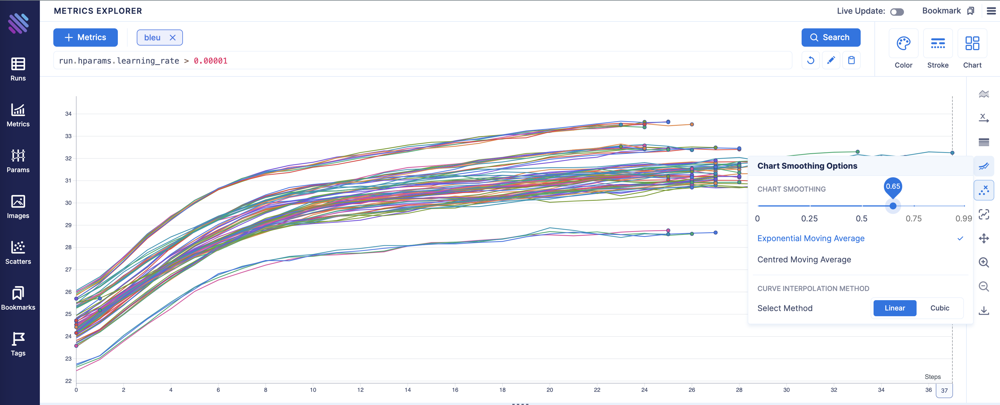

##### Centered moving average

When you center the moving averages, the data points are placed at the center of the range rather than the end of it.
This is done to position the moving average values at their central positions in time.

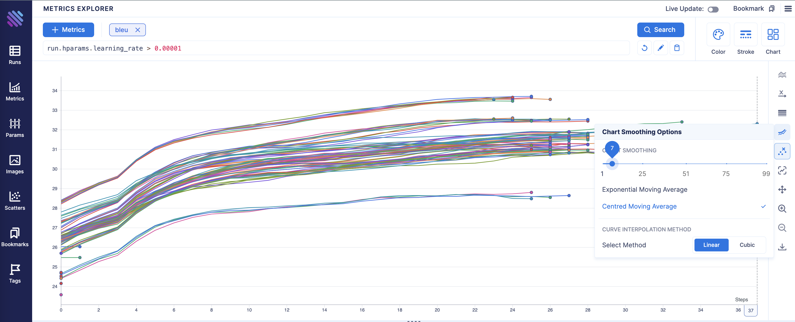

#### Ignore outliers

An outlier is an observation that lies an abnormal distance from other values in a random sample from a population.
Examination of the data for unusual observations that are far removed from the mass of data.
These points are often referred to as outliers.

Excluding outliers can cause your results to become statistically significant.
By default, outliers are ignored.

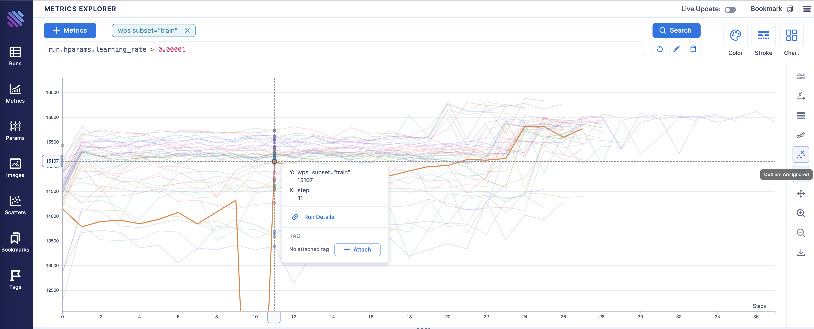

#### Highlight Modes

Highlighting functionality is useful for filtering metrics and highlight only hovered metric.
Following types of highlighting mode are available: [Highlight Off](#highlight-off), [Highlight Metric on Hover](#highlight-metric-on-hover), and [Highlight Run on Hover](#highlight-run-on-hover).
By default, highlighting mode is the [Highlight Run on Hover](#highlight-run-on-hover).

##### Highlight Off

By setting Highlight mode Off, there is no highlighting functionality on hover.

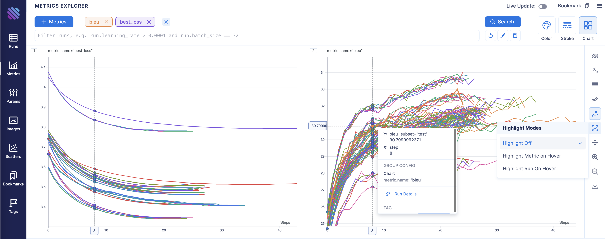

##### Highlight Metric on Hover

By setting Highlight mode Metric on Hover, mouse point closest metric highlights and other metrics displays with opacity.

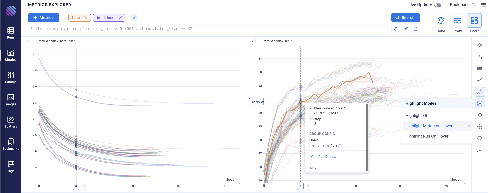

##### Highlight Run on Hover

By setting Highlight mode Run on Hover, mouse point closest metric highlights and highlighted metric corresponding run also highlights other metrics displays with opacity.

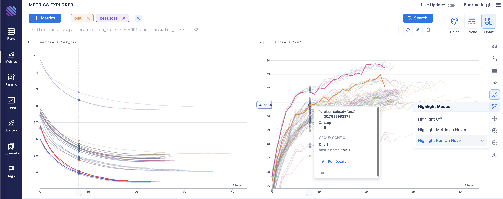

#### Set tooltip parameters

You can select tooltip parameters to show params and values in tooltip Params section.
You can select hide or show button to display or hide tooltip on hover.

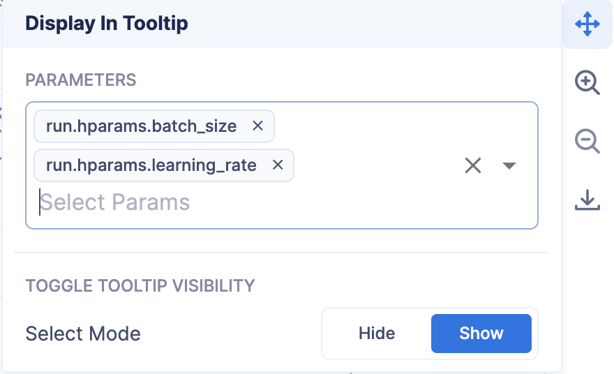

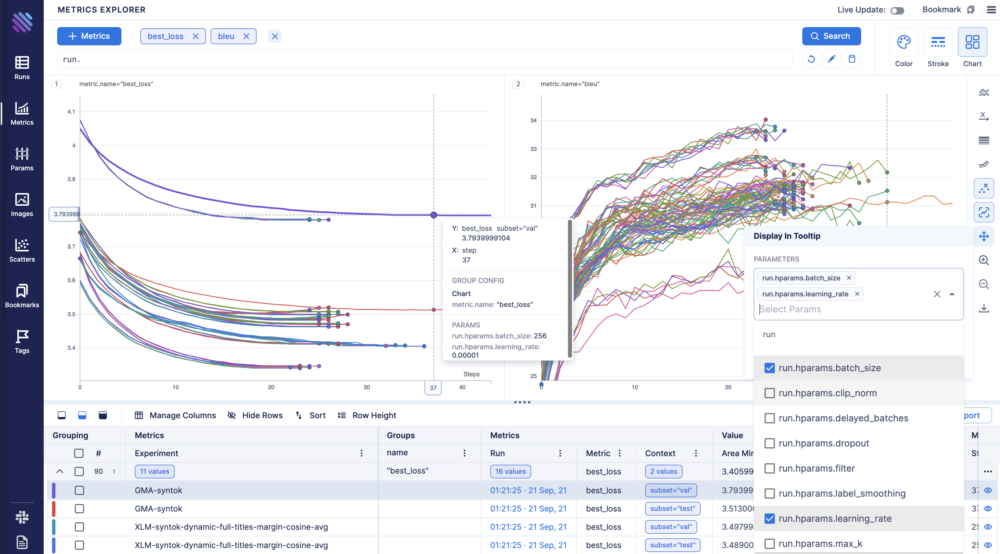

#### Apply zoom on charts

##### Zoom In

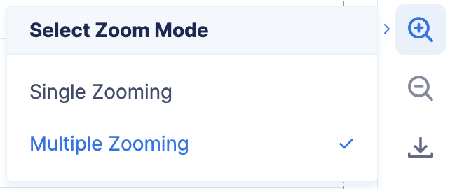

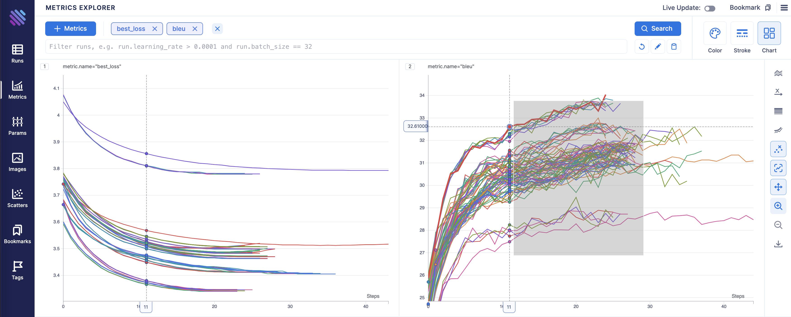

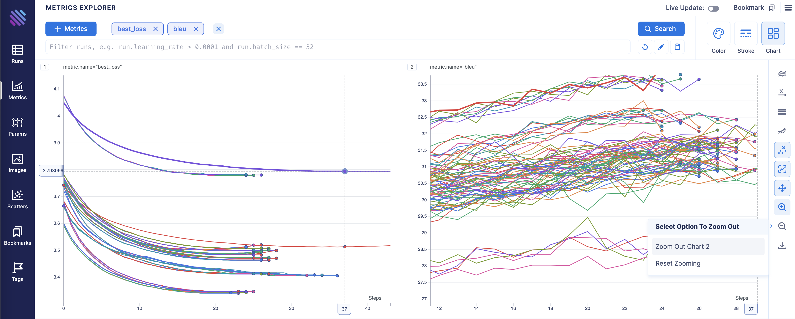

##### Zoom Out

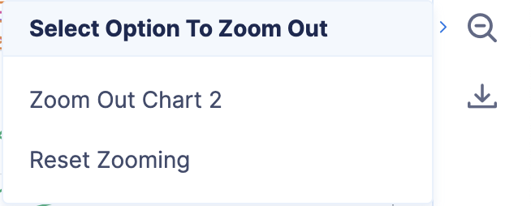

#### Export chart as image

Metric explorer also, gives ability to export your chart as image.
By clicking `export button` from control panel, will be opened chart preview modal.
You can change exportable chart `image width`, `single chart height`, set `image name` and `format`.

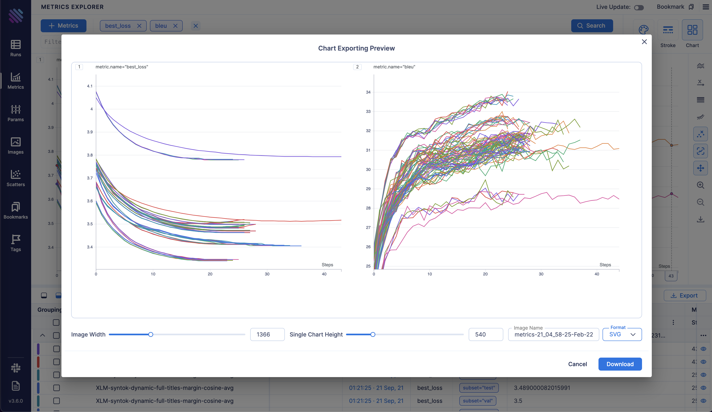

Following formats of chart export are available: `SVG`, `JPEG`, `PNG`.

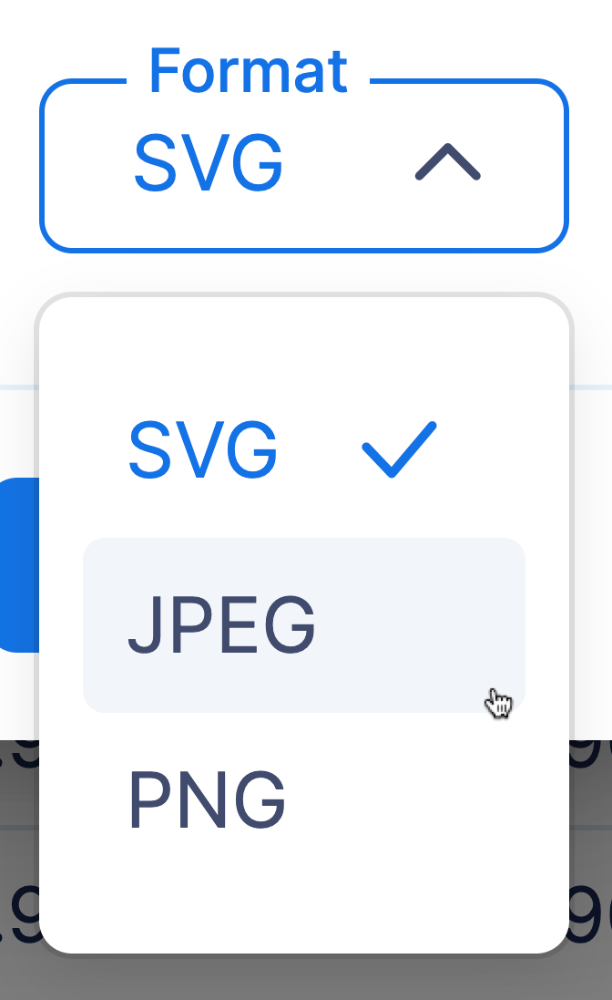

### Images Explorer

### Params Explorer

#### Overview

Params explorer helps you to represent high dimensional data as a multi-dimensional visualization

Features:

- [Easily query any metrics and params](#query-any-metrics-and-params)
- [Group runs by color, stroke, or chart](#grouping)
- [Make the crossings easier with curve interpolation](#curve-interpolation)
- [Learn patterns and colorations easier colored by the last dimension with a color indicator](#color-indicator)

##### Query any metrics and params

Select params and metrics from dropdown

Search runs with [Aim QL](../../using/search.html)

##### Grouping

Group by color, stroke, or chart with selected parameters

##### Curve interpolation

By clicking on the Curve interpolation button in the Controls panel, it's possible to make lines from straight to curve to show
correlations between non-adjacent axes.

##### Color indicator

By clicking on the Color indicator button in the Controls panel, it's possible to turn on lines gradient coloring by the last dimension.

### Scatters Explorer

Scatter explorer gives ability to visualize correlations between metric last value data with hyper-parameter.

It represents graph where corresponding values from a set of data are placed as points on a coordinate plane. A relationship between the points is sometimes shown to be positive, negative, strong, or weak.

Abilities provided by Scatter explorer

- [Easily align metric last value data with hyper parameter](#align-metric-last-value-data-with-hyper-parameter)
- [Group runs by color and chart](#grouping)
- [Represent the points with trend line](#trend-line)
- [Export chart](#export-chart)

##### Align metric last value data with hyper-parameter

Select params and metrics from `X` and `Y` axes dropdowns to align metric last value data with hyper-parameter.

- X axis

- Y axis

Also, you can search runs with [Aim QL](../../using/search.html)

##### Grouping

Easily group data by color and chart with selected parameters.

- By `Color`

- By `Chart`

##### Trend line

A trend line is a straight line that best represents the points on a `scatter plot`. The trend line may go through some points but need not go through them all.

From trend line options popover you can change regression from `Linear` (by default) to `LOESS`(locally weighted smoothing), which creates a smooth line through a `scatter plot` to help you to see relationship between variables and foresee trends. Also, you can change the `bandwidth` with `slider`

##### Export chart

Scatter explorer also, gives ability to `export` your chart as `image`.

By clicking `export button` from control panel, will be opened chart preview modal.
You can change exportable chart `image width`, `single chart height`, set `image name` and `format`.

Following image formats are available export: `SVG`, `JPEG`, `PNG`.

