## Sign In

Sign in to the `Azure portal`.

## Create virtual machine

Enter `virtual machines` in the search or click `Virtual machines` under Azure services.

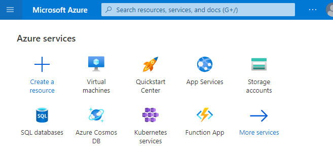

Under Services, select `Virtual machines`.

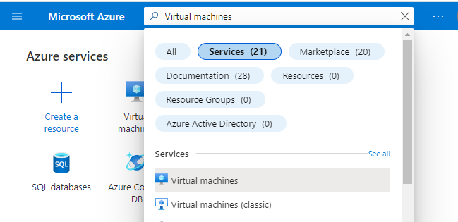

In the Virtual machines page, select `Create` and then `Azure Virtual machine`.


The Create a virtual machine page opens.
In the Basics tab, under Project details, make sure the correct subscription is selected and then choose to Create new resource group. Enter `<name-of-your-choice>` for the name. `aim-rg` will be used in this tutorial

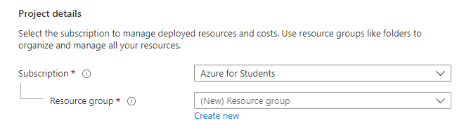

Under Instance details, enter azurevm for the Virtual machine name, and choose `Ubuntu 20.04 LTS - Gen2` for your Image. Leave the other defaults. The default size and pricing is only shown as an example. Size availability and pricing are dependent on your region and subscription.
The `Standard_E2s_v3 - 2 vcpus, 16 GiB` memory will be used in this tutorial


Set authentication type to password. 
Then set username and password and remember it as you will use it to login to your vm.
 
Leave the remaining defaults and then select the `Review + create` button at the bottom of the page.
It will take you to a service pricing webpage. Go through it. When you are done, select Create.

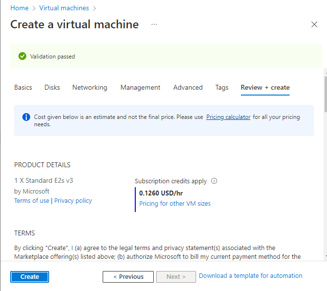

Afte VM deploys finish, click on `Go to resource`.

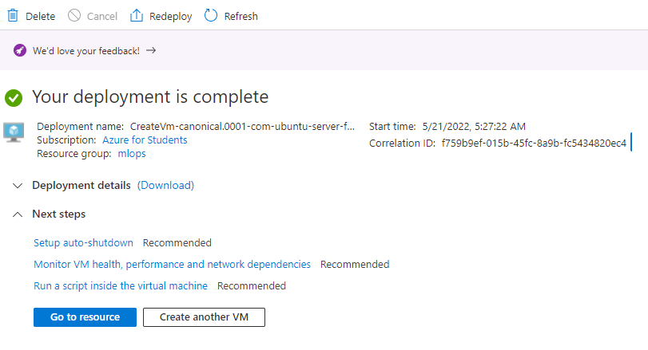

Copy Public IP address

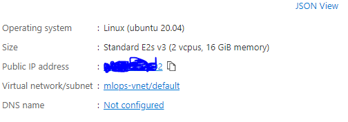

## Connect to virtual machine

I am using a Putty - a free ssh client to connect with vm.
Download link - https://www.chiark.greenend.org.uk/~sgtatham/putty/latest.html
Select the 64 bit - x86 one (first option).

Then open putty.
Then paste the `Public IP address` to this Host Name (or IP address)  field.

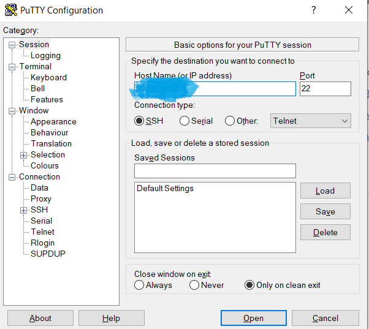

It will open your linux vm like this and ask for login as.


Now type the `username` in this and then the password.
It will be shown something like this with `vm_name@username` format.

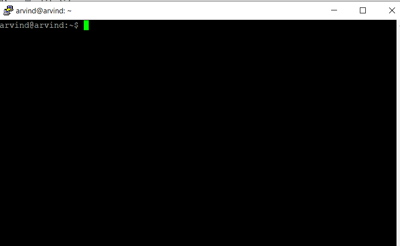

Now install the required packeges by running thi command in vm. - 
```
sudo apt-get install python3 python3-pip python3-venv
```

Then make a directory as project and go into it.
```
# prepare project dir
mkdir ~/project
cd ~/project
```

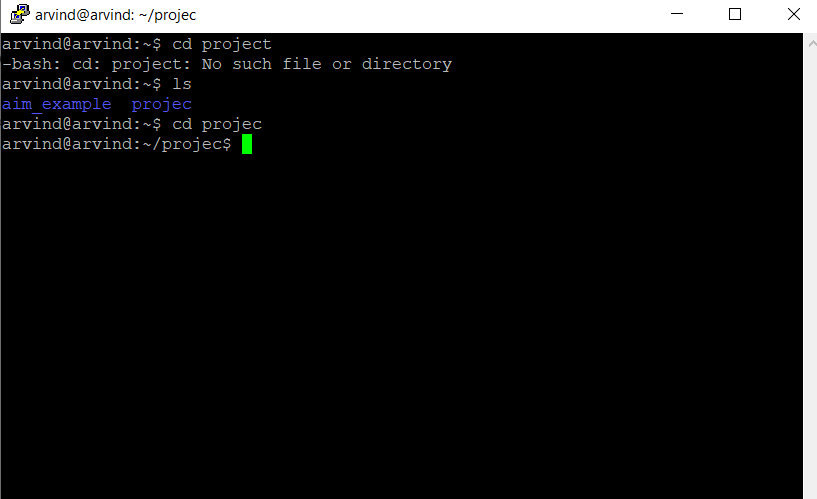

Now, creates a virtualenv using this command and activate it.

```python
# create virtual env
python3 -m venv .venv
source .venv/bin/activate
```

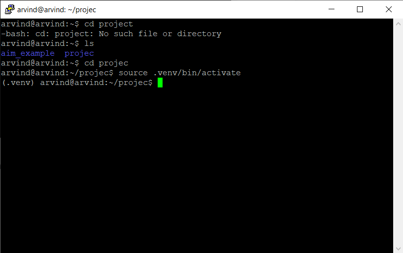

Now, install aim in this environment.
```python
pip install aim
```

And write this in terminal
```
vim main.py
```
<write your code in main.py>

And write this code in that main.py file.

```
from aim import Run

# Initialize a new run
run = Run()

# Log run parameters
run["hparams"] = {
    "learning_rate": 0.001,
    "batch_size": 32,
}

# Log metrics
for i in range(10):
    run.track(i, name='loss', step=i, context={ "subset":"train" })
    run.track(i, name='acc', step=i, context={ "subset":"train" })

```

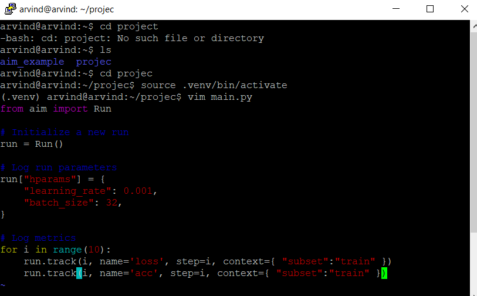

Now, save the code and run
```python
 python ./main.py .  
 ```

Now wait for it to complete.

After that, write ``` aim up --host 0.0.0.0 ```  in terminal.

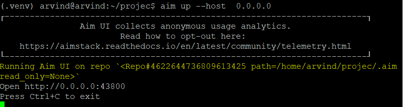

Now, before going to the ` http://127.0.0.1:43800 `, replace ` 0.0.0.0` with your `vm-address` which the `public ip address` of your vm. 

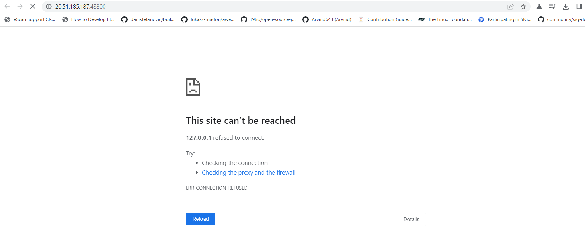

It is showing error and not working because we didn’t added the specified port in azure yet.

now go and open your vm in azure portal and go to `networking.`

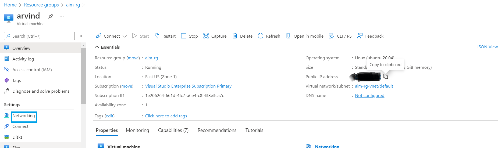

Now, click on `add inbound port rule.`

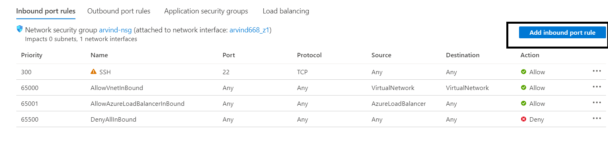

Now write `43800` in destination port ranges and change protocol to `TCP`. 
And click Add.

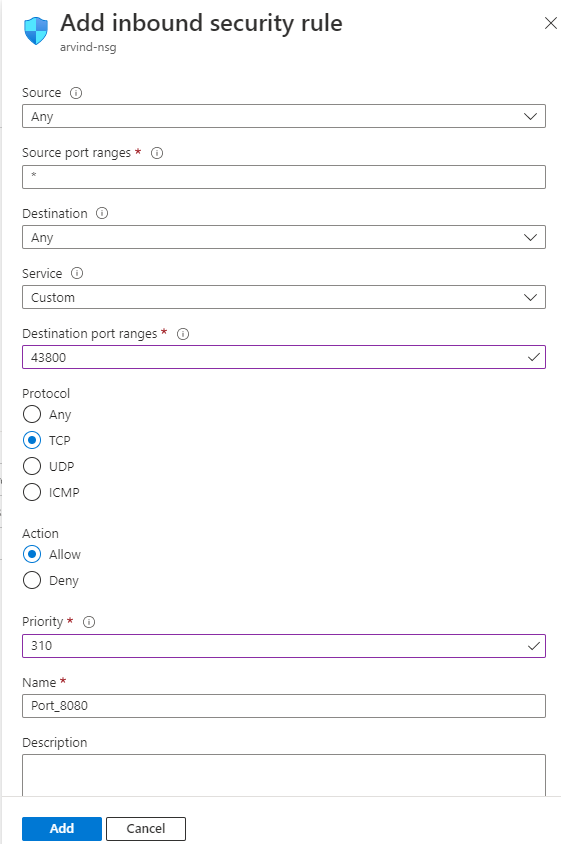

Now, go to your browser and reload the page, if it does not work then restart `aim-up --host 0.0.0.0 `again and open the link in the browser again. You will see something like this in the browser.

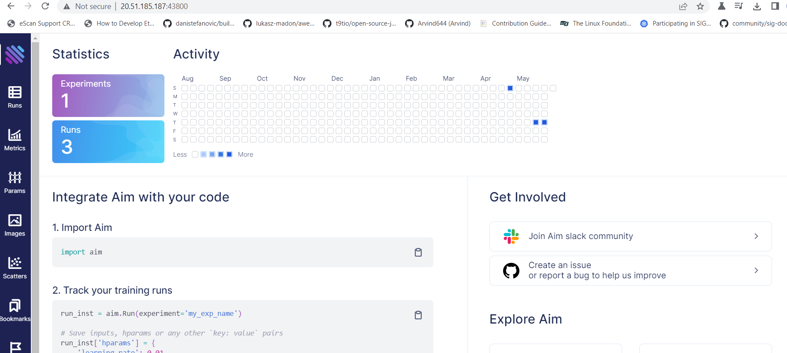
