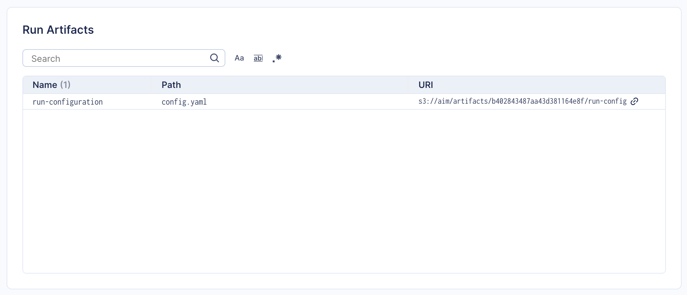

##  Logging artifacts with Aim

One of the key aspects of experiment tracking is the ability to link certain
files/artifacts to the training run metadata. Examples of such artifacts are the
model checkpoints, training run configuration files, etc.

Starting from the version 3.19, Aim provides the logging API for artifacts, and the
UI for showing artifact's metadata.

### Artifacts logging SDK

There are only two steps for logging artifacts with Aim:
1. Set the artifacts storage URI for the Aim Run:
```python
import aim

run = aim.Run()
# Use S3 as artifacts storage
run.set_artifacts_uri('s3://aim/artifacts/')

# Use file-system as artifacts storage
run.set_artifacts_uri('file:///home/user/aim/artifacts/')
```
Aim will create directory with the name of `run.hash` and store all artifacts there. 
Note that setting artifacts storage URI is required only once per run.
2.  Log artifact object:
```python
# Log run configuration files as artifacts
run.log_artifact('config.yaml', name='run-config')
```

Once logged, artifact metadata will appear in the Aim UI Run details page:



### Storage backends

Training artifacts may represent large files, and, depending on the use case, might require
different storage backends. For example, in case of small runs using the local file system,
or network shared FS might be a good option. In case of the large models, cloud-based object
stores, such as AWS S3, may be a better choice.

When the artifacts URI is set, Aim will detect storage backend based on the URI scheme.
Currently supported backends for artifacts storage are.
- S3
- File System

#### S3 Artifacts Storage Backend

Aim uses `boto3` Python package for accessing S3 resources. By default `boto3` targets AWS S3 resources. Connection and credential validation is handled by `boto3`. A typical way of supplying credentials for instance is by setting `AWS_ACCESS_KEY_ID` and `AWS_SECRET_ACCESS_KEY` environment variables.  More details on how configuration is done
for `boto3` is available [here](https://boto3.amazonaws.com/v1/documentation/api/latest/guide/credentials.html).

If you require direct control of how the `boto3` client handles your s3 connection, you may use `aim.storage.artifacts.s3_storage.S3ArtifactStorage_clientconfig(...)`. `S3ArtifactStorage_clientconfig` accepts any keyword-arguments that the `boto3.client` accepts, overwriting other means of boto3 configuration. This allows for the setting of credentials and connection details such as `endpoint_url` and `botocore` [Config](https://boto3.amazonaws.com/v1/documentation/api/latest/guide/configuration.html) parameters.

```python
import aim
from aim.storage.artifacts.s3_storage import S3ArtifactStorage_clientconfig

S3ArtifactStorage_clientconfig(aws_access_key_id=..., aws_secret_access_key=...,
                               endpoint_url=..., config={'retries': {...}, },)
run = aim.Run(...)
run.set_artifacts_uri('s3://...')
run.log_artifact(..., name=...)
```

#### File-system Artifacts Storage Backend

Aim provides ability to use mounted FS as an artifact storage. Any kind of storage that provides a mounted FS
interface can thus be used as Aim artifact storage. However, performance of the solution should be considered
when choosing this approach.
