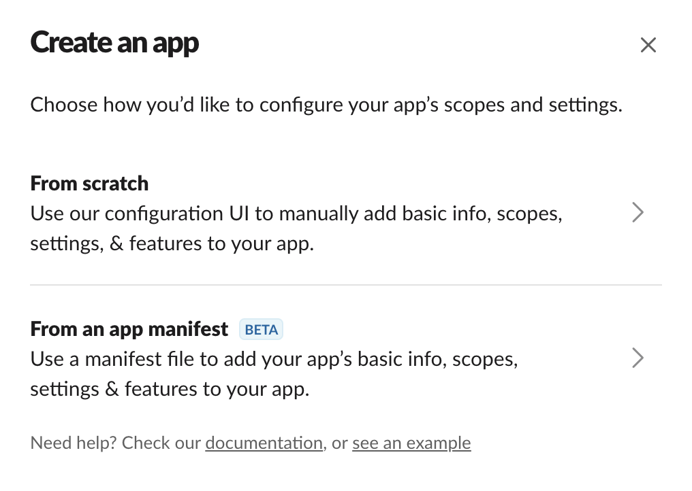
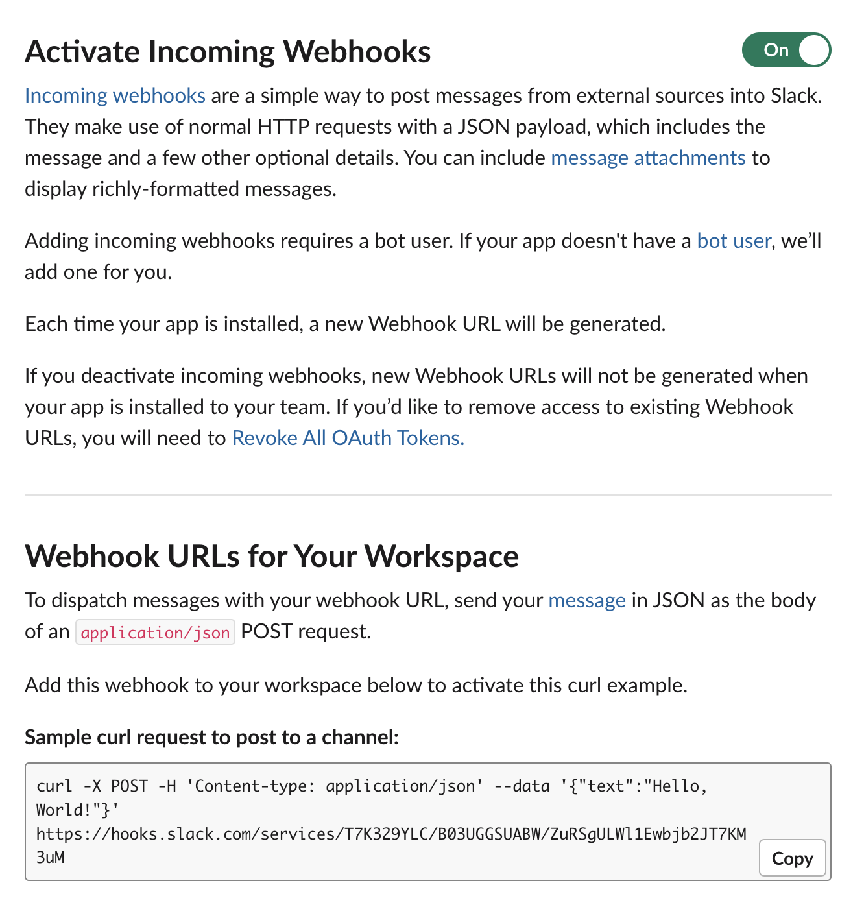

## Run status notifiers configuration

In order to configure how you want to receive notifications about training runs Aim 
provides a CLI tool to interactively choose and setup the notifiers. The base command is:

```shell
aim-watcher notifiers add
```

which will prompt to select one of the supported notifier types. Once you type in notifier
type, watcher will ask fill-in required inputs required for that particular notifier.
Currently supported notifiers are:

- slack
- workplace
- logging

You can have multiple notifiers configured if you want to use multiple channels to receive
notifications. Once notifier configuration added, `aim-watcher` should be restarted, so
new configuration can take effect.

Next sections will describe the setup flow for each of them.

### Configuring notifier for slack

Here are the steps to configure Aim notifier for slack.

1. Go to Slack API web [page](https://api.slack.com) and push "Create an app" button.
   
2. Select "From scratch" and follow the steps.
3. Make sure Incoming Webhooks are active. This is the Slack API Aim will use to send
notifications.
   
4. Create a new Webhook URL and copy to clipboard.
5. Run `aim-watcher add slack` and once prompted for Webhool url, paste the one copied 
in step 4.
6. *Optional* Change the training run failure message template.
7. Confirm setup.


### Configuring notifier for workplace

TODO 

### Enabling/disabling notifier configuration

Aim watcher CLI allows to temporarily disable or completely remove notifiers. Each notifier
configuration has unique auto-generated ID which can be used to manipulate the notifier.
In order to list available notifiers for the aim Repo:

```shell
aim-watcher --repo . notifiers list

> NOTIFIER ID                              TYPE       STATUS    
> 88bbacb3-159d-4ee2-8f33-180addd162f1     slack      enabled   
> 75fe529d-c060-4816-9cbb-246770cb8592     slack      disabled  
> 248821e4-2bf3-4aa9-857e-194bf3ab2f8a     logger     enabled   

```

You can disable notifier by given ID:
```shell
aim-watcher --repo . notifiers disable 88bbacb3-159d-4ee2-8f33-180addd162f1
```

and enable it back:
```shell
aim-watcher --repo . notifiers enable 88bbacb3-159d-4ee2-8f33-180addd162f1
```

In order to remove notifier configuration completely:
```shell
aim-watcher --repo . notifiers remove 88bbacb3-159d-4ee2-8f33-180addd162f1
```

Complete reference for aim-watcher CLI is available [here](../refs/cli.html#aim-status-watcher-cli)).