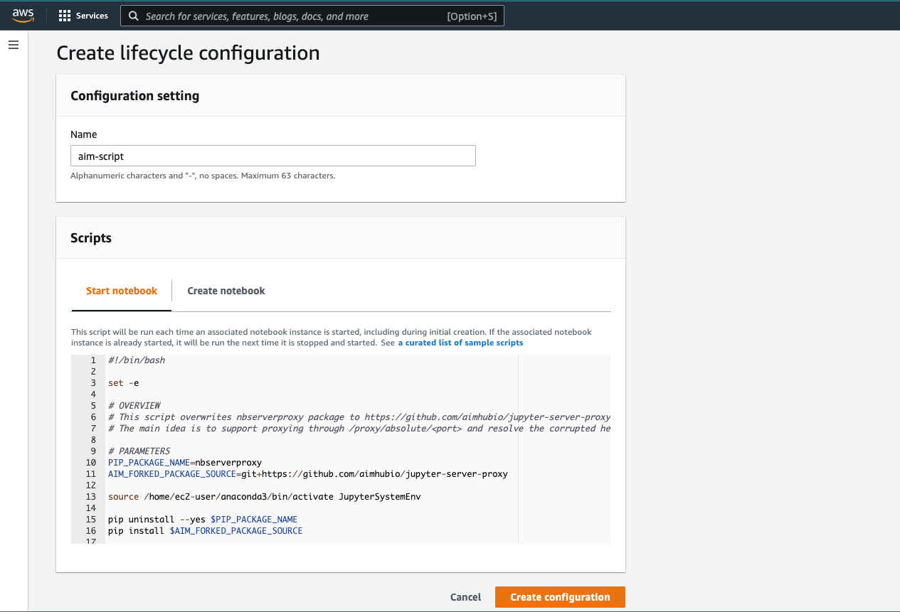
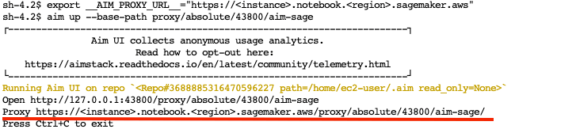
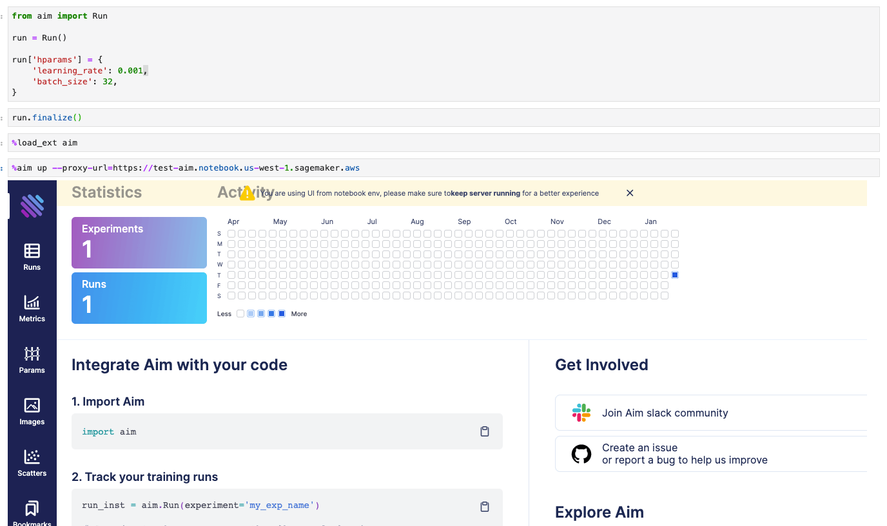
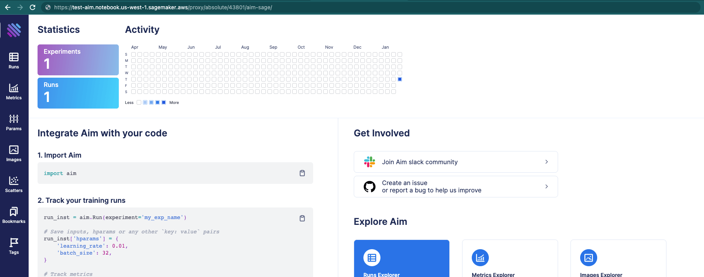

## Run Aim UI on SageMaker Notebook instance

In this guide you will learn how to run Aim UI on your Sagemaker Jupyter instance

Aim can be installed and used on Jupyter notebooks. With SageMaker notebook instance, there are difficulties with establishing POST requests which prevents some Aim functionalities to work.
So we have built a script to update the proxying package on SageMaker notebook instance.
In order to work with Aim UI, please follow the steps below:

- Create a lifecycle configuration on your SageMaker Service.
- Copy and paste the [script](https://github.com/aimhubio/aim/blob/main/aim/scripts/sagemaker/on-start.sh) in your configuration's `Start Notebook` phase.


For more information how to create a lifecycle configuration on AWS SageMaker Service, please go through the [AWS SageMaker Documentation](https://docs.aws.amazon.com/sagemaker/latest/dg/notebook-lifecycle-config.html).

After creating a lifecycle configuration, attach it to your SageMaker instance and restart the instance.

It is possible to run this script manually from the terminal of your jupyter instance as well.

.. Note::
    **Why this script is used for?**

    The script above will uptade the `jupyter-server-proxy` package on your notebook instance.
    To access a port on your instance (i.e. open the Aim UI) API requests and static files need to go through the proxy, which is created by the package (see the script).
    It will replace the existing proxy and make sure Aim and other such requests go through. 
    Fore more information please go through the https://github.com/jupyterhub/jupyter-server-proxy/pull/328#issue-1145874348.

Once your notebook instance is successfully restarted you will be able to use Aim UI on the instance.

Next, install aim.
```shell
$ pip install aim
```

Initialize a new run and save some hyperparameters.
```python
from aim import Run

run = Run()

run['hparams'] = {
    'learning_rate': 0.001,
    'batch_size': 32,
}
```

### Using Terminal

In order to run Aim UI from a terminal, execute the following command:
```shell
$ aim up --base-path=/proxy/absolute/<your-port>/aim-sage
```

After running this command you will be able to open `<sagemker_instance>/proxy/absolute/<your-port>/aim-sage/` in your browser.
The default port is `43800`.

It is possible to set `__AIM_PROXY_URL__` env variable, and `aim up` command will print out the generated url for Aim UI.

To find your proxy url, just copy your SageMaker URL and remove `/lab` postfix.



### Using Notebook Extension

1. Load Aim extension for notebooks:

```jupyter
%load_ext aim
```

2. Run `%aim up` command to open Aim UI in the notebook:

```jupyter
%aim up --proxy-url=https://<instance>.notebook.<region>.sagemaker.aws
```

Will load the Aim UI in the notebook cell.



Will print out the proxy url under the loaded Aim UI. Use that URL to open Aim UI on your browser.



The default port is `43801` for  notebook  extension to prevent confusions.
The `--port=<your-port>` argument is supported as well.

.. note::
   In notebook extension, the only mandatory argument is `--proxy-url` when using it on SageMaker.
